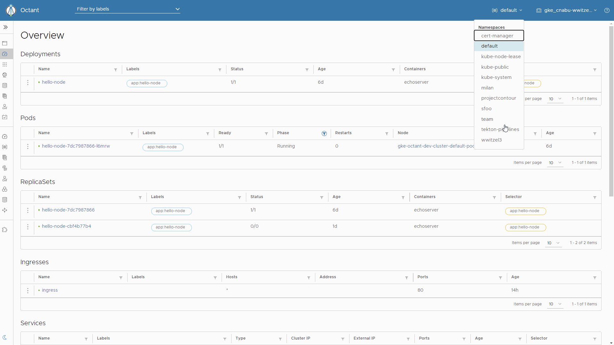

![Logo][octant-logo]

[](https://cloud.drone.io/vmware-tanzu/octant)

[](https://opensource.org/licenses/Apache-2.0)

> A web-based, highly extensible platform for developers to better understand the complexity of Kubernetes clusters.

Octant is a tool for developers to understand how applications run on a Kubernetes cluster. It aims to be part of the developer's toolkit for gaining insight and approaching complexity found in Kubernetes. Octant offers a combination of introspective tooling, cluster navigation, and object management along with a plugin system to further extend its capabilities.

## Features

* **Resource Viewer**

    Graphically visualizate relationships between objects in a Kubernetes cluster. The status of individual objects are represented by color to show workload performance.

* **Summary View**

    Consolidated status and configuration information in a single page aggregated from output typically found using multiple kubectl commands.

* **Port Forward**

    Forward a local port to a running pod with a single button for debugging applications and even port forward multiple pods across namespaces.
 
* **Log Stream**

    View log streams of pod and container activity for troubleshooting or monitoring without holding multiple terminals open.

* **Label Filter**

    Organize workloads with label filtering for inspecting clusters with a high volume of objects in a namespace.

* **Cluster Navigation**

   Easily change between namespaces or contexts across different clusters. Multiple kubeconfig files are also supported.

 * **Plugin System**

   Highly extensible plugin system for users to provide additional functionality through gRPC. Plugin authors can add components on top of existing views.

## Usage



## Installation

### Package (Linux only)

1. Download the `.deb` or `.rpm` from the [releases page](https://github.com/vmware-tanzu/octant/releases).

2. Install with either `dpkg -i` or `rpm -i` respectively.

###  Windows

#### Chocolatey

1. Install using chocolatey with the following one-liner:

   ```sh
   choco install octant --confirm
   ```

#### Scoop

1. Add the [extras](https://github.com/lukesampson/scoop-extras) bucket.

   ```sh
   scoop bucket add extras
   ```

2. Install using scoop.

   ```sh
   scoop install octant
   ```

### macOS

#### Homebrew

1. Install using Homebrew with the following one-liner:

   ```sh
   brew install octant
   ```

### Download a Pre-built Binary (Linux, macOS, Windows)

1. Open the [releases page](https://github.com/vmware-tanzu/octant/releases) from a browser and download the latest tarball or zip file.

2. Extract the tarball or zip where `X.Y` is the release version:

    ```sh
    $ tar -xzvf ~/Downloads/octant_0.X.Y_Linux-64bit.tar.gz
    octant_0.X.Y_Linux-64bit/README.md
    octant_0.X.Y_Linux-64bit/octant
    ```

3. Verify it runs:

    ```sh
    $ ./octant_0.X.Y_Linux-64bit/octant version
    ```

## Nightly Builds

Nightly builds of Octant are available for download.

Please note that nightly builds maybe less stable than our tagged releases and are intended to allow early access to
preview upcoming features and for plugin authors who want access to the latest plugin APIs.

[Browse nightly builds](https://console.cloud.google.com/storage/browser/octant-nightlies)

## Getting Started

Before starting Octant, make sure you have access to a healthy cluster. If kubectl is installed, test using `kubectl cluster-info`.

Start running Octant:

`$ octant`

Octant should immediately launch your default web browser on `127.0.0.1:7777`.

Or to run it on a specific host and fixed port:
`$ OCTANT_LISTENER_ADDR=0.0.0.0:8900 octant`

For configuring Octant, setting up a development environment, or running tests, refer to the [documentation](https://octant.dev/docs/master).

## Plugins

Plugins are a core part of Octant in the Kubernetes ecosystem. A plugin can read objects and allows users to add components to Octant's views.

An example plugin can be found in [`cmd/octant-sample-plugin`](cmd/octant-sample-plugin) and installed to the default plugin path with `go run build.go install-test-plugin`.

Documentation for plugin components can be found in the [Plugins section](https://octant.dev/docs/master/plugins/) of the documentation.

## Discussion

Feature requests, bug reports, and enhancements are welcome. Contributors, maintainers, and users are encouraged to collaborate through these communication channels:

 - [Kubernetes Slack](http://slack.k8s.io/) in the [#octant](https://kubernetes.slack.com/app_redirect?channel=CM37M9FCG) channel
 - [Twitter](https://twitter.com/projectoctant)
 - [Google group](https://groups.google.com/forum/#!forum/project-octant/)
 - [GitHub issues](https://github.com/vmware-tanzu/octant/issues)

## Contributing

New contributors will need to sign a CLA (contributor license agreement). We also ask that a changelog entry is included with your pull request. Details are described in our [contributing](CONTRIBUTING.md) documentation.

See our [hacking](HACKING.md) guide for getting your development environment setup.

See our [roadmap](ROADMAP.md) for tentative features in a 1.0 release.

## License

Octant is available under the [Apache License, Version 2.0](LICENSE)

[octant-logo]: /site/docs/master/octant-logo.png
